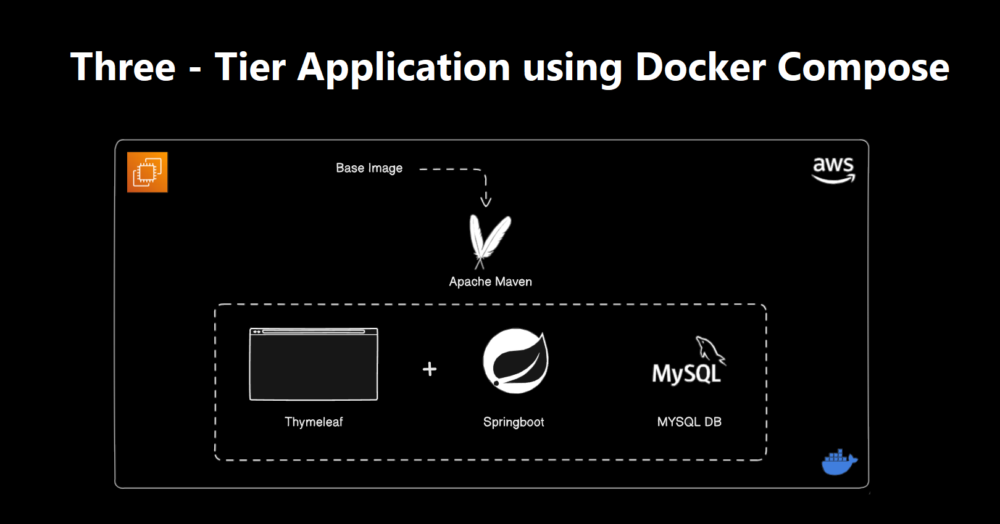
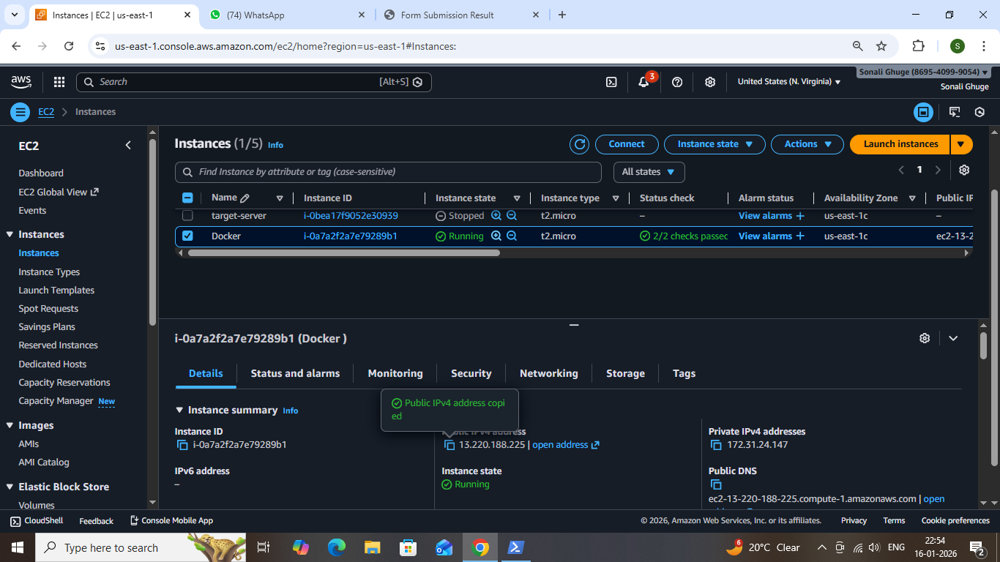
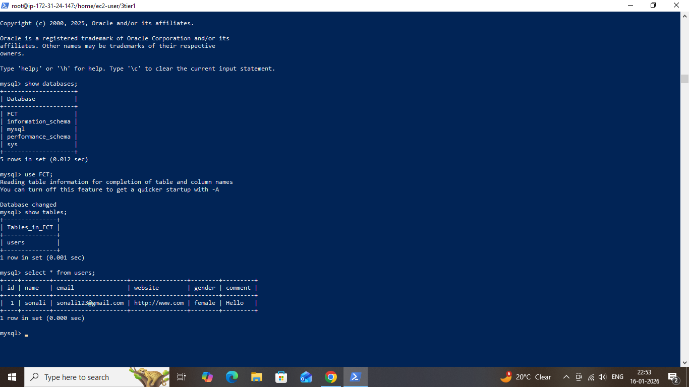

# Docker-3tier-web-application
 ## Overview

This repository demonstrates how to design, containerize, and deploy a Three-Tier Web Application using Docker and Docker Compose on an AWS EC2 instance. The project is built to mirror an industry-style deployment where each layer of the application is isolated into its own container, improving scalability, maintainability, and reliability.

The main focus of this project is to gain hands-on experience with container orchestration, service-to-service communication, and cloud-based deployment using Docker. 

### Project Goal :

The purpose of this project is to:

- Understand real-world three-tier architecture implementation

- Learn Docker Compose for managing multiple services

- Practice container networking and volumes

- Deploy a containerized application on AWS EC2

### Architecture Overview

The application is divided into three independent layers, each running in a separate Docker container.

### 1. Web Tier (Nginx)

- Acts as the frontend web server

- Serves the signup HTML page

- Forwards requests to the application layer

### 2. Application Tier (PHP-FPM)

- Processes form submissions

- Contains backend business logic

- Communicates with the database container

### 3. Database Tier (MySQL)

- Stores user data persistently

- Initialized automatically during container startup

### Request Lifecycle
    User Browser
        ↓
    Nginx (Web Layer)
        ↓
    PHP-FPM (Application
    Layer)
        ↓
    MySQL (Database Layer)

### Directory Structure 
    threetier/
    │
    ├── web/
    │   ├── code/
    │   │   └── signup.html
    │       └── config/
    │       └── default.conf
    │
    ├── app/
    │   └── code/
    │       └── submit.php
    │
    ├── db/
    │   ├── Dockerfile
    │   └── init.sql 
    │
    └── docker-compose.yml

Each folder represents an independent service, keeping the project clean and modular.

### Technology Stack :

   Component	  Description
   Docker	      Application containerization
   DockerCompose Multi-container orchestration
   Nginx	     Frontend web server
   PHP-FPM	     Backend application runtime
   MySQL	     Relational database
  AWS EC2	    Cloud hosting platform  

  ### Docker & Compose Implementation :

- MySQL container is automatically initialized using an SQL script

- Each tier runs in its own isolated container

- Database container uses a persistent volume to avoid data loss

- Custom Docker networks ensure controlled communication between services

- Service dependencies are managed using depends_on

- Entire application is managed through a single docker-compose.yml file

### Database Details :

- Database Name: FCT

- Table Name: users

### Table Columns :

- id

- name

- email

- website

- comment

- gender

### Application Output :

Below screenshots demonstrate the complete working of the application across all layers.

### 1. Architecture Diagram :

### 2. AWS EC2 Instance :

3. Docker Compose Execution

### 4. Running Containers :

### 5. Signup Form :

6. Form Submission :

### 7. Database – MySQL :

### Key Takeaways
- Gained practical experience in containerizing applications using Docker, including building images, running containers, and managing their lifecycle.

- Learned how to use Docker Compose to manage and orchestrate multiple services together, making application deployment simpler and more organized.

- Understood the real-world implementation of a three-tier architecture by separating the web, application, and database layers into independent containers.

### Conclusion :

This project demonstrates a complete Dockerized three-tier web application deployed on AWS EC2. It highlights practical usage of Docker Compose for service orchestration, container networking, and persistent storage, reflecting a real-world production-style architecture.

### Author: 

Sonali Ghuge

Gitub : https://github.com/iamSonaliGhuge/docker-3tier-web-application.git

Medium: 

Linkedin: 